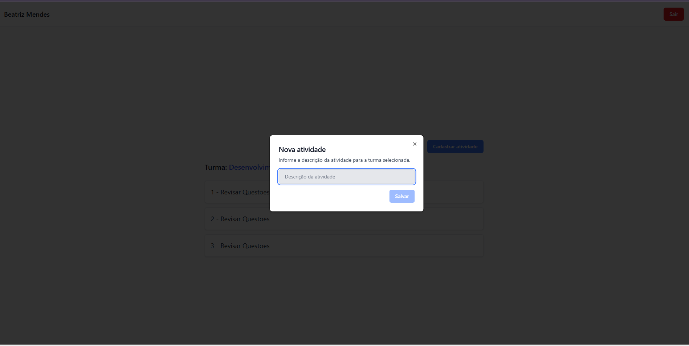
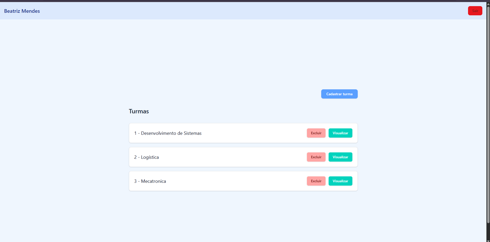
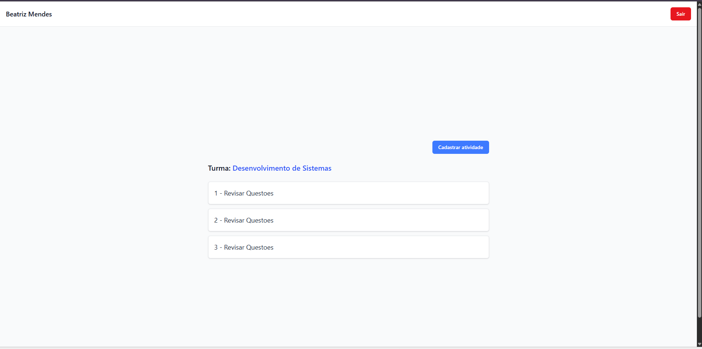
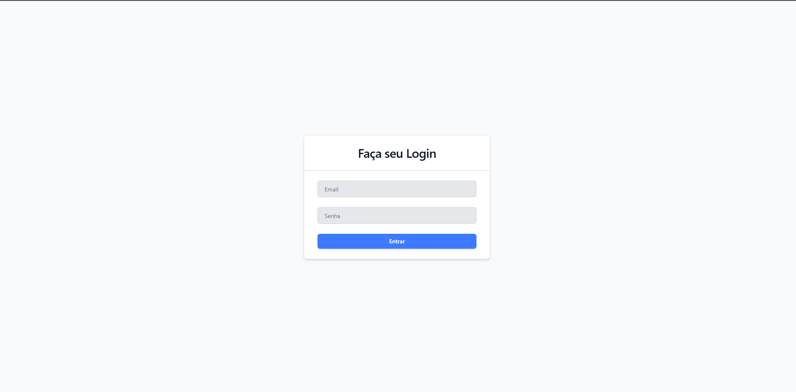

# Escola Api Mobile

## Tecnologias
- Node.js
- MySQL (XAMPP)
- Prisma
- React.js
- Vite

## Tutorial para executar API e Web

- Clone o repositorio e apos clonar entre na pasta `./web` e cole o seguintes comandos.

```bash
cd web
npm install
npm run dev
```

Apos isso clique no link `http://localhost:5173/`.

- Logo depois desse processo abra outro CMD e entre dentro da pasta `./api` e cole os seguintes comandos.

```bash
npm install
npx prisma migrate dev --name init
npx nodemon
```

Agora voce pode testar o Back-End e Front-End do Projeto Escola Mobile

## Wireframes e Diagramas






